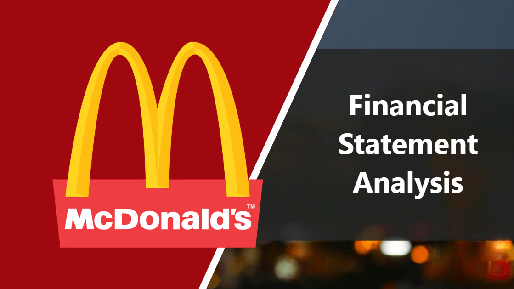
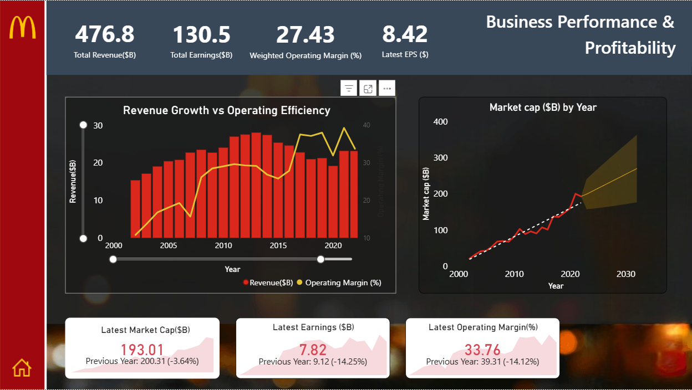

🍔 McDonald’s Financial Performance & Market Valuation Dashboard
📌 Project Overview

This project presents an end-to-end Business Intelligence dashboard built using Power BI, analyzing McDonald’s financial performance and investor valuation over time.
The goal is to translate financial data into clear, actionable business insights for stakeholders.

🎯 Objectives

Analyze business growth, profitability, and efficiency

Evaluate shareholder value and market valuation

Apply financial fundamentals using modern BI and GenAI tools

Design an executive-ready dashboard with strong storytelling

📊 Dashboard Structure

🔹 Page 1: Business Performance & Profitability

A single combined chart visualizing:

Revenue ($B) – Business growth

Earnings ($B) – Profitability

Operating Margin (%) – Operational efficiency

EPS ($) – Shareholder profitability

Purpose: Assess whether the company is growing profitably and operating efficiently at scale.

🔹 Page 2: Investor Value & Market Valuation

Key investor-focused metrics:

P/E Ratio – Price paid for ₹/$1 of profit

P/S Ratio – Price paid for ₹/$1 of revenue

P/B Ratio – Market value vs book value

Dividends & Cash Strength

Debt & Liabilities

Purpose: Understand how the market values McDonald’s and assess financial risk and shareholder returns.

🔍 Key Insights

Weighted Operating Margin provides a more realistic efficiency measure by emphasizing high-revenue years

Revenue growth is supported by stable operating efficiency

EPS trends reflect both performance improvement and share structure

Strong cash position supports consistent dividend payouts

Valuation ratios above 1 reflect brand value, growth expectations, and investor confidence

🛠 Tools & Technologies

Power BI,DAX, Financial Analysis, GenAI (ChatGPT, ThoughtSpot)

🚀 Future Enhancements

Forecasting market capitalization and earnings

Scenario analysis using valuation multiples

Industry benchmarking against competitors

Automated refresh with live financial data

👤 Author

G S L MAHA 

🔗 LinkedIn: https://www.linkedin.com/in/gslmaha
